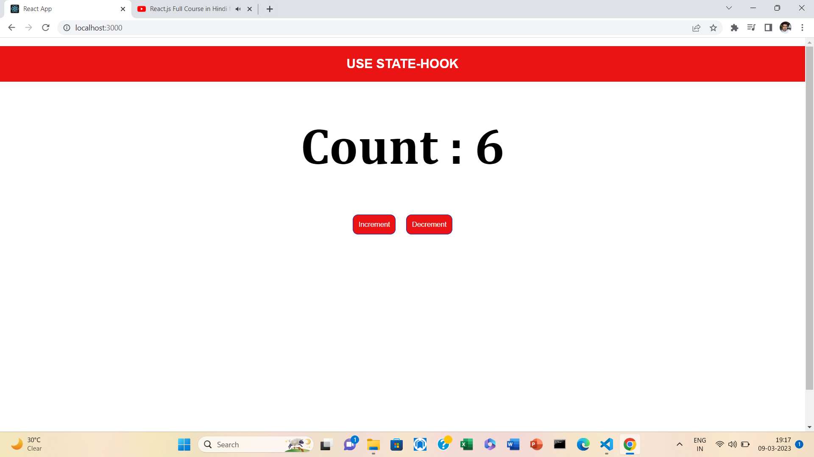
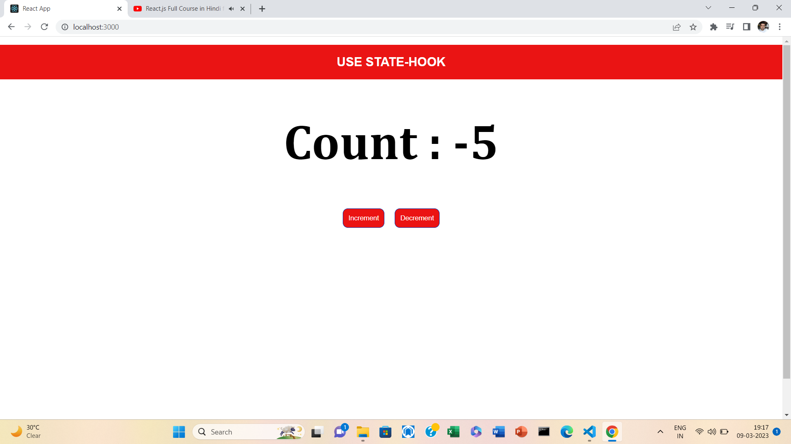

# REACT USE STATE HOOKS-

## This hook focuses on one specific thing. It allows you to add state to your function components.🤠 This means that you no longer have to work with class components. You also no longer have to convert function components to classes just so you can use state.

## When creating a React app, we'll almost always need a way to store / manage state within our component(s) — the useState React Hook allows us to do this in a cleaner and more concise way😃.

## import React,{useState} from 'react'
//inside any component function
const [name,setName] = useState('KAPIL')

When we declare a state variable with useState, it returns a pair — an array with two items. So, by writing square brackets we are doing array destructuring.

1. The first item is the current value which is KAPIL.

1. The second function is the one that lets you update the state (to change the value of the state).

## HOOKS--

### Hooks allow functional components to access state and other react life cycle features. Hooks were introduced in February 2019 as part of React 16.8 version. Since then it has played a major role in react application development.

### They will help you make your code clearer and better structured😀. The classic class-based syntax is still supported and will keep being supported for the foreseeable future.

### Hooks🪝 enable React functional components to use React features that were previously only available in React class components.

### Hooks🪝 are just like JavaScript’s function but there are certain rules to be followed while using hooks.

### Call hooks only at the top level-
### This means that we should never call hooks inside a loop, conditions, or even nested functions and should be only called in the React functions. This maintains the order of components whenever it is rendered. This rule ensures that Hooks are called in the same order each time a component renders.

### SMALL MINI COUNTER APP WITH REACT

